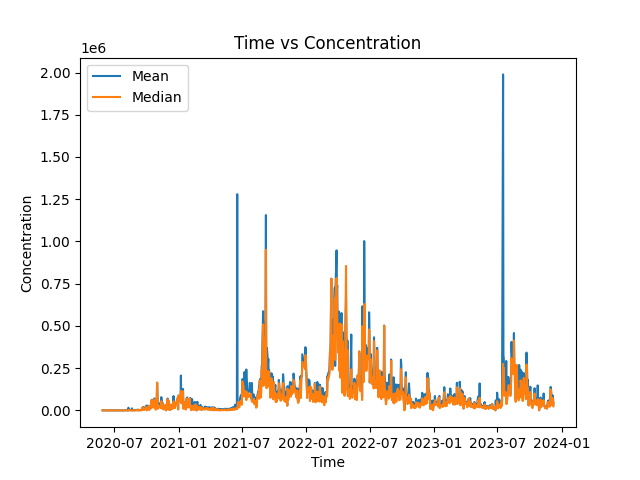

# SARS-CoV-2 in wastewater 
  
Name:  Gabriel Ramirez Vilchis (<gramirez@lcg.unam.mx>)  
Name:  Santiago Orozco Barrera (<santiago@lcg.unam.mx>)  
  

Date:  Oct/15/2024  

  
  
## Introduction  
  
 

SARS-CoV-2 is the virus responsible of coronavirus disease 19 (COVID-19), which became a worlwide pandemic a few years ago. This virus is tought to be spread by droplets produced when a person coughs or sneezes, and also by touching infected surfaces and then touching mouth, eyes or nose. In this context, they were also found elements from this coronavirus in wastewater in many different countries. Concentrations of these elements were measured and registered in open-access databases, with samples from different places and from different dates. 


## Problem Statement

We hypothesized that the concentration of coronavirus elements in wastewaters will increase or decrease through time, responding to the pandemic stage.  
Our objective is to find a tendency in coronavirus elements concentrations to increase or decrease.


## Methods

The data that we used for this project comes from the Global Water Pathogens Project 2024, and it is available in https://sphere.waterpathogens.org/search. 
The main information that it contains is a sample ID, a location ID, the date and the concentration.  
This data is written in many CSV files, which are essentially composed by the following columns:  
- Sample ID
- Lab Method ID
- Site ID
- Date/Time
- Sample Collection Type
- Target
- Target Type
- Target Result
- Target Concentration
- Target Units
- Target Detection Limit


### A. Server and Software

> Server: chaac.lcg.unam.mx  

> User: --

> Software: --

### B. Input data 

We filtered the original data file, and only conserved the useful columns for the purpose of this project.     


The filtered data file was processed using Bash and it is available in `data/filtered_virus_wastewater.tsv`, in this repository.

```
|-- data
|   `-- filtered_virus_wastewater.tsv
```


#### Metadata


Original database ID:  NC_000913.3

Fecha de descarga: 09/30/2024

| Archivo | Descripción  | Tipo |
|:--      |:--           |:--  |
| filtered_echinoderms.tsv  | Filtered database of echinoderms with its taxonomy and distribution | Tab-separated values file |
| water_distribution.tsv   | Environmental characteristics related to location | Tab-separated values file |


#### Files format


#### Files format

 

- `filtered_echinoderms.tsv` : Filtered database of echinoderms with its taxonomy and distribution


```
"id","decimal_latitude","decimal_longitude","kingdom","phylum","class","order","family","genus","subgenus","specie","taxon_scientific_name","individual_count","country_full","state_province","water_body","depth"
"1","20.8911111","-86.8505556","Animalia","Echinodermata","Crinoidea","Comatulida","Comasteridae","Nemaster","","Nemaster rubiginosa","Nemaster rubiginosa","2","Mexico (MX)","Quintana Roo","Atlantico",""
```

Format:  

 a. First line contains the columns names.

 b. In the next lines are the values for each variable in the database.

 c. These are the values in each column:

```
1. id
2. decimal_latitude
3. decimal_longitud
4. kingdom
5. phylum
6. class
7. order
8. family
9. genus
10. subgenus
11. specie
12. taxon_scientific_name
13. individual_count
14. country_full
15. state_province
16. water_doby
17. depth 
```


#### Research questions
##### A. Is there a correlation between the taxonomy of echinoderms and their distribution?  
1. Data filtering: using Shell, we filter the columns that interest us (taxonomy and sample location) and are located in Mexican territory. See [filtred_echinoderms.tsv]
2. Clustering using sample location and water conditions. We divide Mexican oceans according to their latitude and longitude, and create clusters of different water conditions.  
3. See if there is a relationship between the generated group and the species. We assign every echinoderm to a cluster according to its location, and then evaluate if there is a significant correlation.

##### B. What are the locations with the largest ammount of echinoderms?  
1. Statistic test: We order the clusters according to the amount of echinoderms related to them, and then characterize those that have significantly more echinoderms in them.

##### C. How has the distribution of echinoderms changed througout time?  
1. Classification: We classify the samples according to the century they come from.
2. Relation. Using the same clusters from the previous questions, we repeat the procedure of assigning echinoderms to each cluster, but this time also considering the century of origin.  
3. Comparison: We compare the clusters with the most of the samples for each century.  


## Results
 
##### A. How did concentration of SARS-CoV-2 in wastewater change througout time?  
By analizing mean concentration, we found  
 

##### B. What are the locations with the largest ammount of echinoderms?  

##### C. How has the distribution of echinoderms changed througout time?  


## Discussion and Conclusion

 <!-- Describir todo lo que descubriste en este análisis -->


## References

1. _NCI Dictionary of Cancer Terms._ (s. f.). Cancer.gov. https://www.cancer.gov/publications/dictionaries/cancer-terms/def/sars-cov-2

