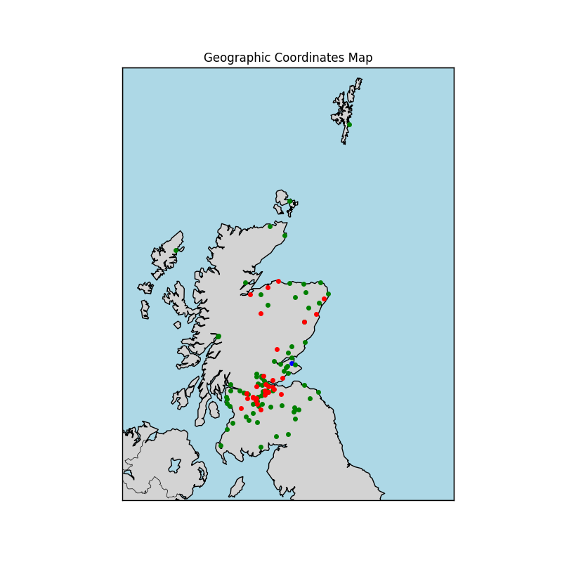
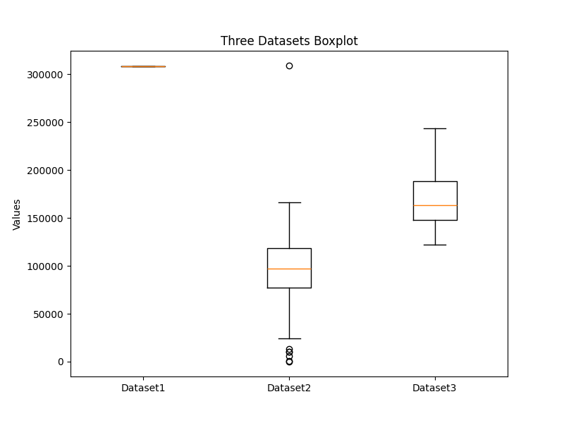
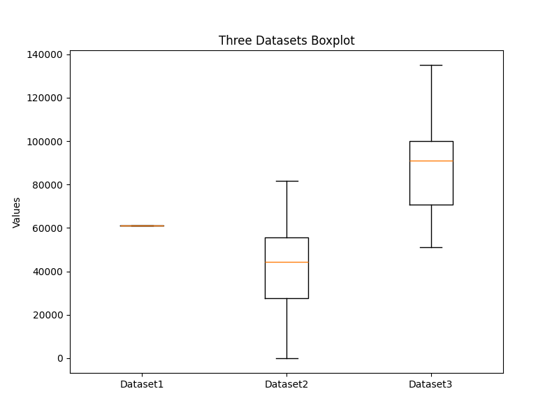

  

# SARS-CoV-2 in wastewater 
  
Name:  Gabriel Ramirez Vilchis (<gramirez@lcg.unam.mx>)  
Name:  Santiago Orozco Barrera (<santiago@lcg.unam.mx>)  
  

Date:  Nov/25/2024  

  
  
## Introduction  
  
 

SARS-CoV-2 is the virus responsible of coronavirus disease 19 (COVID-19), which became a worlwide pandemic a few years ago. This virus is tought to be spread by droplets produced when a person coughs or sneezes, and also by touching infected surfaces and then touching mouth, eyes or nose. In this context, they were also found elements from this coronavirus in wastewater in many different countries. Concentrations of these elements were measured and registered in open-access databases, with samples from different places and from different dates. 


## Problem Statement

We hypothesized that the concentration of coronavirus elements in wastewater will increase or decrease through time, responding to the pandemic stage.  
Our objective is to find a tendency in coronavirus elements concentrations to increase or decrease.


## Methods

The data that we used for this project comes from the Global Water Pathogens Project 2024, and it is available in https://sphere.waterpathogens.org/search. 
The main information that it contains is a sample ID, a location ID, the date and the concentration.  
This data is written in many CSV files, which are essentially composed by the following columns:  
- Sample ID
- Lab Method ID
- Site ID
- Date/Time
- Sample Collection Type
- Target
- Target Type
- Target Result
- Target Concentration
- Target Units
- Target Detection Limit


### A. Server and Software

> Server: chaac.lcg.unam.mx  

> User: --

> Software: --

### B. Input data 

We filtered the original data file, and only conserved the useful columns for the purpose of this project.     


The filtered data file was processed using Bash and it is available in `data/filtered_virus_wastewater.tsv`, in this repository.

```
|-- data
|   `-- filtered_virus_wastewater.tsv
```


#### Metadata


Original database ID:  NC_000913.3

Fecha de descarga: 09/30/2024

| Archivo | Descripción  | Tipo |
|:--      |:--           |:--  |
| filtered_echinoderms.tsv  | Filtered database of echinoderms with its taxonomy and distribution | Tab-separated values file |
| water_distribution.tsv   | Environmental characteristics related to location | Tab-separated values file |


#### Files format


#### Files format

 

- `filtered_echinoderms.tsv` : Filtered database of echinoderms with its taxonomy and distribution


```
"id","decimal_latitude","decimal_longitude","kingdom","phylum","class","order","family","genus","subgenus","specie","taxon_scientific_name","individual_count","country_full","state_province","water_body","depth"
"1","20.8911111","-86.8505556","Animalia","Echinodermata","Crinoidea","Comatulida","Comasteridae","Nemaster","","Nemaster rubiginosa","Nemaster rubiginosa","2","Mexico (MX)","Quintana Roo","Atlantico",""
```

Format:  

 a. First line contains the columns names.

 b. In the next lines are the values for each variable in the database.

 c. These are the values in each column:

```
1. id
2. decimal_latitude
3. decimal_longitud
4. kingdom
5. phylum
6. class
7. order
8. family
9. genus
10. subgenus
11. specie
12. taxon_scientific_name
13. individual_count
14. country_full
15. state_province
16. water_doby
17. depth 
```


#### Research questions  
##### A. How are the samples distributed?   
1. Generate clusters of the samples in dataset acording to the location ID.    
2. Generate a map of the samples, to see where the most of them were located.  
  
##### B. By clustering the samples by location, which cluster contains the highest concentrations? 
1. With the clusters created for the previous question, create a bocxplot to show which of the clusters has the highest concentration values.  
  
##### C. How did concentration of SARS-CoV-2 in wastewater change througout time?  
1. Generate a plot of the concentration variation throught diferrent months, in order to find out which months reported the highest concentrations of SARS-CoV-2 residues in wastewater.  


## Results

##### A. How are the samples distributed?  
We generated the following map creating clusters acording with the locations IDs of each sample. In doing so, we realized that most of SARS-CoV-2 samples in wastewater were located in Dumfries and Galloway, and also in Scottish Borders.  
  

##### B. By clustering the samples by location, which cluster contains the highest concentrations?  
We also analized the clusters generated by location, looking for that one with the highest concentrations. In both plots it is important to notice that dataset 1 just contains one sample, so it is not that relevant in this comparison.  
By analyzing the mean values, we found that dataset 3 got the highest concentrations.  
  
We observed the same result by comparing datasets by median concentration values.  
 

##### C. How did concentration of SARS-CoV-2 in wastewater change througout time?  
By analizing mean concentration variation throughout time, we found that the highest peaks ocurred about August 2021 and in March 2022, decreasing until the final months of 2022. During 2023, we do not see peaks as high as in the previous year, but we still found an increase around Agoust 2023.  
 


## Discussion and Conclusion
In this analysis, we found that most of the samples in the dataset came from Scottish Borders, Dumfries and Galloway, so the results that we present are representative of those places.  
When we clustered the samples by location, we observed that the third one got the highest concentrations. Most of the samples in this cluster (red dots in map) are located near the borders with England, so maybe the movement of people from one country to another could be an important factor to make this cluster have a higher concentration of SARS-CoV-2 elements in wastewater.  
Finally, we saw one of the highest peaks in SARS-CoV-2 elements concentration in wastewater after January 2022, which is a few months after Omicron variant was reported and when many of the restrictions to avoid COVID-19 propagation were relaxed or removed. We also found a peak in mean concentrations around August 2023, but we do not see this in median concentrations, which may indicate that there were just a few samples that presented extremely high concentrartions, which could indicate the places were restrictions were more relaxed or where medical material used to treat COVID-19 was mostly threw to water.    
In conclusion, COVID-19 pandemic was an historic event that has a remarkable effect in human lifestyle and in our environment, and even a few years after the beggining of this crisis, we are still recovering from it.  


## References

1. _NCI Dictionary of Cancer Terms._ (s. f.). Cancer.gov. https://www.cancer.gov/publications/dictionaries/cancer-terms/def/sars-cov-2
2. The Scottish Government. (2022, January 11). _Coronavirus (COVID-19): state of the epidemic - 7 January 2022._ https://www.gov.scot/publications/coronavirus-covid-19-state-epidemic-07-january-2022/
3. Arrebola, A. O. Á. G. (2022, January 18). _Escocia termina con las restricciones impuestas por la expansión de ómicron._ ElDiario.es. https://www.eldiario.es/sociedad/ultima-hora-coronavirus-actualidad-politica-18-enero_6_8664322_1083608.html
